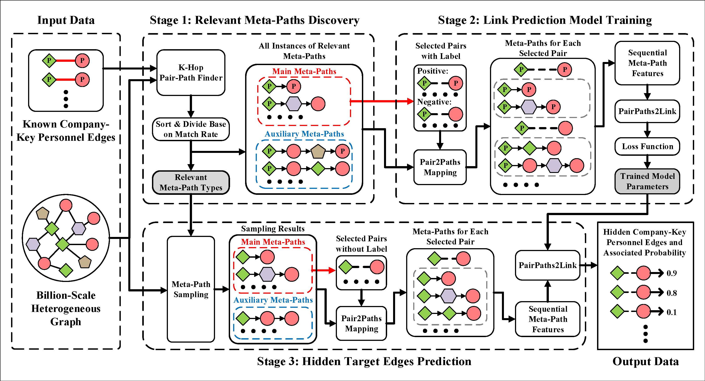

# Paths2Pair Framework

Paths2Pair is a framework designed to discover hidden target edges from billion-scale heterogeneous graphs based on known target edges. The framework helps JD Logistics efficiently find more than 100,000 key personnel of companies.

The overall workflow is shown in the following figure.

## Folder Structure

- **Main Folder:** Contains the core components of our framework.
- **Utils Folder:** Provides essential utilities and tools for framework operations.
- **Model Folder:** Includes a collection of baseline models.

The paper about this framework is currently under review at [OpenReview](https://openreview.net/forum?id=3f16chu3yQ).
